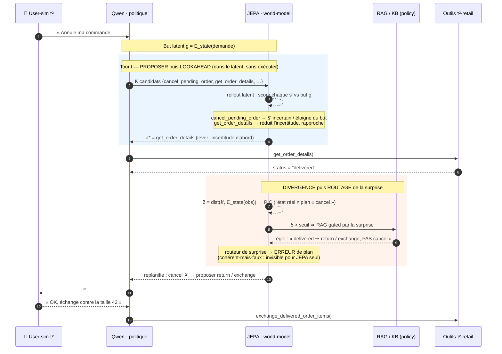

# morpheus

**M**odèle à **O**ntologie **R**éelle par **P**erception **H**iérarchique d'un **E**space **U**niversel de **S**ens.

> *« This is your last chance. After this, there is no turning back. »*

Deux pilules. Deux façons de croire qu'une machine peut *juger*.

**La pilule bleue** — le confort. On admet que l'agentique longue tâche restera l'apanage des modèles frontier fermés et des MoE de 200B à 1000 milliards de paramètres, tournant sur des fermes de GPU. On appelle une API, on ne cherche pas à comprendre, et le monde reste tel qu'on nous le montre.

**La pilule rouge** — le pari de morpheus. On regarde jusqu'où va le terrier du lapin : tenir des tâches longues (**10+ tours d'outils**) sur **un seul GPU (< 5000 €, ~32 Go VRAM)**, non pas en gonflant le modèle, mais en lui donnant un *monde intérieur* pour planifier.

## Le pari

Le goulot pour égaler Sonnet 4.5 / Opus 4.8 en agentique n'est **plus la syntaxe d'appel d'outil** — un ~32B la maîtrise déjà. Ce qui manque, c'est la **couche de jugement multi-tours** : savoir quand appeler un outil (et quand ne pas le faire), garder le fil de l'objectif sur 10-15 appels, récupérer intelligemment après une erreur.

morpheus garde **Qwen comme politique** et lui adjoint un **world-model latent de type JEPA** qui simule les conséquences d'une action *avant* de l'exécuter, en **boucle fermée** (MPC à horizon glissant) : imaginer un plan, exécuter un pas, ré-ancrer sur l'état *réel*, replanifier. L'erreur ne se compose pas — chaque tour ré-ancre sur la vérité.

## Le nœud à craquer

Un pic d'erreur de prédiction — la **surprise** — ne dit pas *pourquoi* il survient :

- **« j'ai fauté »** → une erreur à corriger ;
- **« le monde est plus riche que mon plan »** → c'est mon plan qui avait tort.

Les deux produisent la même surprise. Le cœur scientifique de morpheus est le **routeur de surprise** qui désambiguïse ces deux régimes et déclenche en conséquence la récupération de connaissance (**RAG gated par la divergence**) — le seul mécanisme capable d'attraper la classe d'erreurs *cohérentes-mais-fausses*, structurellement invisibles pour JEPA.

## Le principe en action — une trace τ²-retail

Cas concret, tiré du domaine retail de τ²-bench. L'utilisateur demande d'**annuler une commande** — mais la commande est déjà `delivered`, et la politique du domaine est formelle : *« An order can only be cancelled if its status is 'pending' »*. Une commande livrée ne peut qu'être **retournée ou échangée**.

- **Qwen nu (glouton)** — entend « annule » → appelle `cancel_pending_order` sur une commande livrée. La syntaxe d'appel est *parfaite*, l'action est *invalide* : erreur **cohérente-mais-fausse**. L'outil refuse, l'agent boucle ou abandonne.
- **morpheus** — le world-model *anticipe* (lookahead avant d'agir), puis *rattrape* le décalage via la divergence + RAG gated. Il n'exécute jamais l'annulation condamnée.

Ce que JEPA induit ici : (1) **choisir de vérifier avant d'agir** au lieu de foncer (lookahead), (2) transformer un état inattendu (`delivered`) en **pic de divergence** qui déclenche le RAG, (3) **ré-ancrer sur l'état réel** et replanifier — sans jamais exécuter l'action condamnée. La baseline gloutonne, elle, aurait consommé un tour sur un appel voué à l'échec.

## Où regarder

| Document | Contenu |
|---|---|
| [specs/00-contexte-experience.md](specs/00-contexte-experience.md) | D'où vient l'idée, les faits qui la cadrent, la thèse, le vrai problème ouvert. |
| [specs/01-orchestrateur-jepa-qwen.md](specs/01-orchestrateur-jepa-qwen.md) | L'architecture : rôles Qwen / JEPA / RAG, boucle fermée, routeur de surprise, prototype minimal. |
| [specs/02-benchmark-reference.md](specs/02-benchmark-reference.md) | L'évaluation : τ²-bench (figé), cibles chiffrées, protocole de mesure. |

**Bench de départ** : τ²-bench (retail puis telecom). **Cible réaliste** : approcher Sonnet 4.6 sur un seul GPU — pas le décrocher, l'*approcher*, ce qui serait déjà une rupture.

## Travaux antérieurs

morpheus se tient sur des épaules. La référence la plus proche :

- **[LeWorldModel (LeWM)](https://github.com/lucas-maes/le-wm)** — L. Maes, Q. Le Lidec, D. Scieur, Y. LeCun, R. Balestriero, *« Stable End-to-End Joint-Embedding Predictive Architecture from Pixels »* ([arXiv 2026](https://arxiv.org/abs/2603.19312), [site](https://le-wm.github.io/)). Un world-model **JEPA latent** entraîné de bout en bout (deux termes de perte seulement : prédiction du prochain embedding + régularisateur gaussien), **~15M paramètres, entraînable en heures sur un seul GPU**, qui planifie ~48× plus vite que les alternatives à modèle de fondation, sur du contrôle 2D/3D à partir de pixels. C'est la **preuve de faisabilité du pilier « world-model JEPA stable, latent, single-GPU »** sur lequel morpheus parie. **Ce que morpheus change** : LeWM planifie dans un monde *perceptif* (pixels, contrôle continu) ; morpheus transpose l'idée à l'agentique *symbolique* — environnement d'outils τ²-bench, observations en texte, Qwen comme politique — et lui adjoint la brique absente ici, le **routeur de surprise + RAG gated** pour attraper le *cohérent-mais-faux*.

Les autres travaux qui cadrent l'approche (détaillés dans [`specs/`](specs/)) :

- **I-JEPA / VICReg** — recette d'entraînement JEPA anti-collapse (cible EMA / stop-gradient, régularisation de variance-covariance) reprise pour le prédicteur latent.
- **LWM-Planner** — extraction en ligne de **faits atomiques** depuis l'expérience de l'agent, injectés dans un RAG : la source directe du « RAG *gated* par la surprise ».
- **RAP / « Reasoning via Planning », MCTS-LLM** — le LLM comme world-model pour un lookahead type MPC/arbre : c'est la **Phase 1** de morpheus (baseline à battre avant d'introduire le JEPA entraîné).
- **`stable-worldmodel`** — l'effondrement empirique des world-models sous perturbation mineure / hors-distribution : précisément le régime (« évaluation d'états surprenants ») que le routeur de surprise de morpheus doit adresser.

*Remember: all I'm offering is the truth. Nothing more.*
